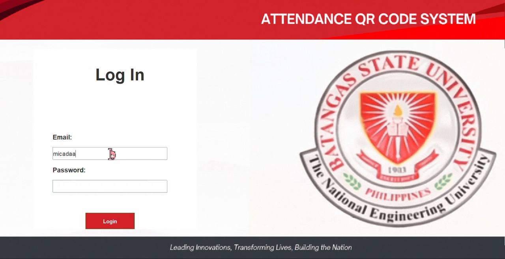
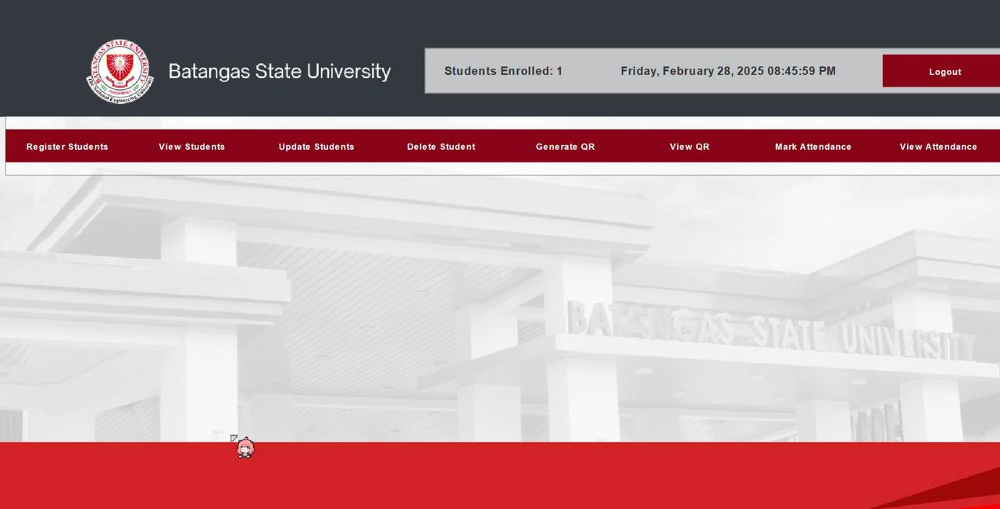

# Attendance QR System

A student attendance tracking system using **QR code scanning**, built with **Java Swing**. This application streamlines classroom attendance by allowing admins to register students, generate QR codes, and scan them using a webcam to log attendance in real time.

> Built using **Java Swing**, webcam integration, and QR code generation libraries.

---

## 📑 Table of Contents

- [Overview](#-overview)
- [Objectives](#-objectives)
- [Tech Stack](#-tech-stack)
- [System Features](#-system-features)
- [Screenshots](#-screenshots)
- [How to Run](#-how-to-run)
- [Project Members](#-project-members)
- [License](#-license)

---

## Overview

The **Attendance QR System** enables efficient and contactless attendance tracking using QR codes and webcam scanning. Admins can register students, generate and store unique QR codes, and track attendance records. Students can log in to view their details and attendance status.

---

## Objectives

- Replace manual attendance with **QR-based scanning**
- Allow **admins to register** students and generate QR codes
- Scan student QR codes via webcam for real-time tracking
- Enable **students to view** their QR and attendance
- Store attendance logs in a database for review and tracking
- Support **data export**, updating student profiles, and system monitoring

---

## Tech Stack

| Tech                        | Purpose                             |
|-----------------------------|-------------------------------------|
| **Java Swing**              | GUI / UI Framework                  |
| **MySQL**                   | Database                            |
| **net.glxn.qrgen**          | QR Code generation                  |
| **sarxos.webcam-capture**   | Webcam integration for QR scanning  |
| **Gson**                    | Object serialization / Type tokens  |

---

## System Features

### Admin Dashboard

- Register students with details + student code  
- Upload student profile photos
- Generate unique QR code per student  
- Save or print student QR  
- Scan QR via webcam to log attendance  
- View & search student attendance logs  
- Update student details anytime  
- Export data for record-keeping  

### Student Dashboard

- View profile and student ID  
- Access their unique QR code  
- View personal attendance record  

---
## Screenshots

Click to view screenshots 📷

 

  
  
  

  
  
  

  
  

 
  
  

---

## 📬 Contact & Credits

Developed as a finals project by **Danah Paris**

📧 Email: micadanah21@gmail.com

📌 School: **BatStateU - ARASOF Nasugbu** | Course: **BSIT**

## License
This project was built for educational purposes.
Feel free to explore and learn, but please credit when using this project.
